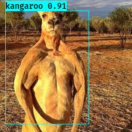
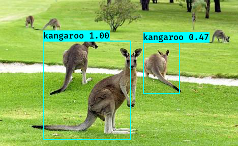
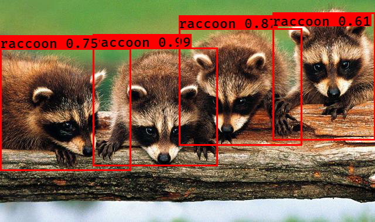
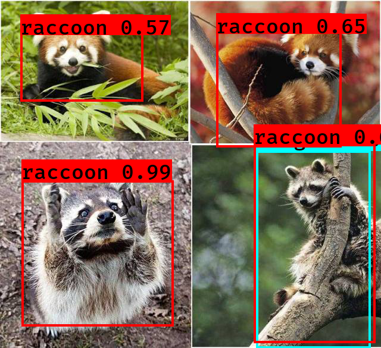

#  Kangaroo & Raccoon Detection by Keras-YOLOv3

[](LICENSE)

## Introduction

A Keras implementation of YOLOv3 (Tensorflow backend) inspired by [qqwweee/keras-yolo3](https://github.com/qqwweee/keras-yolo3).<br>

<br>

<br>
[](http://www.youtube.com/watch?v=8gWVzPGTyMo "Kangaroo")
[](http://www.youtube.com/watch?v=DV1PYejPbGg "Raccoon")

---

## Quick Start

1. Download YOLOv3 weights from [YOLO website](http://pjreddie.com/darknet/yolo/).
2. Convert the Darknet YOLO model to a Keras model.
3. Run YOLO detection.

```
wget https://pjreddie.com/media/files/yolov3.weights
python convert.py yolov3.cfg yolov3.weights model_data/yolo.h5

python yolo_video.py --model_path logs/svhn_weights/trained_weights_final.h5
                     --anchors_path model_data/yolo_anchors.txt
		     --classes_path model_data/svhn_classes.txt
		     --gpu_num 1
		     --input video_path

python yolo_video.py --img ./data/test/1.png
python yolo_video.py --imgdir ./data/test 
```

For Tiny YOLOv3, just do in a similar way, just specify model path and anchor path with `--model model_file` and `--anchors anchor_file`.

---
## Training

1. Download training data from [experiencor/kangaroo](https://github.com/experiencor/kangaroo) & [experiencor/raccoon_dataset](https://github.com/experiencor/raccoon_dataset)<br>
(Kangaroo dataset may lose some images. 183 images actually is 164)<br>
(#8、15、35、57、58、63、67、68、70、82、104、106、126、133、135、138、142、160、165)
```
	wget https://github.com/experiencor/kangaroo/archive/master.zip -O kangaroo.zip
	wget https://github.com/experiencor/raccoon_dataset/archive/master.zip -O raccoon.zip
	unzip kagaroo.zip
	unzip raccoon.zip
```

2. Move Annotations & Images into the Directory
	```
	mv kangaroo-master/images/* data/images
	mv kangaroo-master/annots/* data/annotations
	mv raccoon_dataset-master/images/* data/images
	mv raccoon_dataset-master/annotations/* data/annotations
	python voc_annotation.py
	```

3. Generate your own annotation file and class names file. **(option)** 
    One row for one image;  
    Row format: `image_file_path box1 box2 ... boxN`;  
    Box format: `x_min,y_min,x_max,y_max,class_id` (no space).  
    For VOC dataset, try `python voc_annotation.py`  
    Here is an example:
    ```
    path/to/img1.jpg 50,100,150,200,0 30,50,200,120,3
    path/to/img2.jpg 120,300,250,600,2
    ...
    ```

2. Make sure you have run `python convert.py -w yolov3-spp.cfg yolov3-spp.weights yolov3-spp-weight/yolov3-spp_weights.h5`  
    The file yolov3-spp-weight/yolov3-spp_weights.h5 is used to load pretrained weights.

3. Modify train.py and start training.  `python train.py` 
	
    Use your trained weights or checkpoint weights with command line option `--model model_file` when using yolo_video.py
    Remember to modify `annotation path`, `anchor path`, `classes path` ,  `log_dir path` and `weights_path` when create model.


---

### Usage
Use --help to see usage of yolo_video.py:
```
python yolo_video.py [OPTIONS...] --image, for image detection mode, OR
python yolo_video.py [video_path] [output_path (optional)]
```
```
usage: yolo_video.py [-h] [--model MODEL] [--anchors ANCHORS]
                     [--classes CLASSES] [--gpu_num GPU_NUM] [--image]
                     [--input] [--output]

positional arguments:
  --input        Video input path
  --output       Video output path

optional arguments:
  -h, --help         show this help message and exit
  --model MODEL      path to model weight file, default model_data/yolo.h5
  --anchors ANCHORS  path to anchor definitions, default
                     model_data/yolo_anchors.txt
  --classes CLASSES  path to class definitions, default
                     model_data/coco_classes.txt
  --gpu_num GPU_NUM  Number of GPU to use, default 1
  --image            Image detection mode, will ignore all positional arguments
  --imgdir           Image dir detection mode, will ignore all positional arguments
  --txt                 Image dir detection will output txt files
```
---


## Some issues to know

1. The test environment is
    - Python 3.6.9
    - Keras 2.2.5
    - tensorflow-gpu 1.14.0

2. Default anchors are used. If you use your own anchors, probably some changes are needed.

3. The inference result is not totally the same as Darknet but the difference is small.

4. The speed is slower than Darknet. Replacing PIL with opencv may help a little.

5. Always load pretrained weights and freeze layers in the first stage of training. Or try Darknet training. It's OK if there is a mismatch warning.

6. The training strategy is for reference only. Adjust it according to your dataset and your goal. And add further strategy if needed.

7. For speeding up the training process with frozen layers train_bottleneck.py can be used. It will compute the bottleneck features of the frozen model first and then only trains the last layers. This makes training on CPU possible in a reasonable time. See [this](https://blog.keras.io/building-powerful-image-classification-models-using-very-little-data.html) for more information on bottleneck features.
